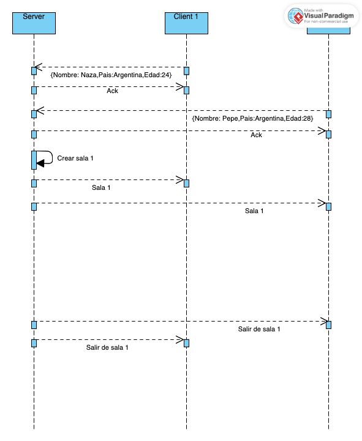
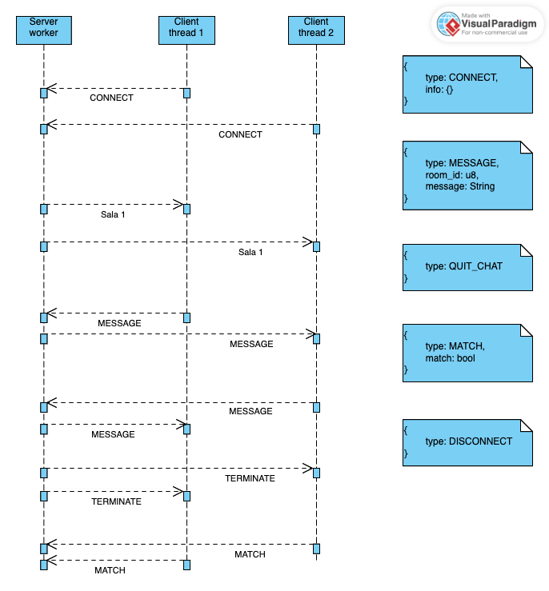

# Rust-LAND
### Integrantes:
- Lourengo Caridade, Lucia 104880
- Rueda, Nazarena 106280
- Su, Agustina Doly 105708

### Cómo correr la aplicación

Correr server: `cargo run --config_name`

```
cd server
cargo run config.txt
```

Correr client: `cargo run --host --port`

```
cd client
cargo run 127.0.0.1 9244
```

### Aplicación para speed dating

#### Semana 6/11

Diagrama de secuencia para creación de salas



Diagrama de secuencia para threads en el server




# RUST

## Historia de Rust

- Rust surgió de un proyecto personal iniciado en 2006 por Graydon Hoare, empleado de Mozilla Research.
- Mozilla patrocinó oficialmente el proyecto en 2009.
- A partir de 2015, cuando estuvo la primera versión estable, empresas como Amazon, Discord, Dropbox, Meta, Google y Microsoft adoptaron Rust.
- En diciembre de 2022, se convirtió en el primer lenguaje distinto de C y ensamblador compatible con el desarrollo del kernel de Linux.

## Sintaxis

### Hola Mundo!

```rust
fn main() {
    println!("Hello, World!");
}
```
### Macro

### Pattern Matching

La coincidencia de patrones se puede realizar utilizando la palabra clave match.

```rust
fn main() {
    let mut values = vec![1, 2, 3, 4];

    match values.len() {
        0 => println!("Empty"),
        1 => println!("One value"),
        // pattern matching can use ranges of integers
        2..=10 => println!("Between two and ten values"),
        11 => println!("Eleven values"),
        // A `_` pattern is called a "wildcard", it matches any value
        _ => println!("Many values"),
    };
}
```

### Predicate

### Closures

En términos funcionales, un closure es un scope persistente que retiene las variables locales incluso después de que la ejecución del código haya salido de ese bloque.
Viendo la perspectiva de los closures dentro del paradigma de POO, podemos entender a los closures como la parametrización de comportamiento.

Ejemplo de Closures con parámetros:

```rust
let suma = |n1, n2| n1 + n2;
```

Ejemplo de Closures sin parámetros:

```rust
let saludo = || println!("Hello, world!");
```


### Types

### Punteros / Referencias

Rust está diseñado para ser seguro para la memoria. No permite punteros nulos, punteros colgantes ni race conditions. Los valores de datos requieren que sus entradas ya estén inicializadas.
Rust no utiliza garbage collector automatizado. La memoria y otros recursos se gestionan mediante la convención de inicialización anteriormente mencionada
Los valores se asignan en el stack de forma predeterminada y todas las asignaciones dinámicas deben ser explícitas.

### Azucar Sintáctica

### Ownership

El sistema de ownership de Rust consta de reglas que garantizan la seguridad de la memoria sin utilizar un garbage collector. En tiempo de ejecución, cada valor debe estar asociado a una variable denominada owner de ese valor, y cada valor debe tener exactamente un owner.
Los valores se mueven entre diferentes owners mediante asignación o pasando un valor como parámetro de función. Los valores también se pueden tomar prestados, lo que significa que se pasan temporalmente a una función diferente antes de devolverlos al owner. Con estas reglas, Rust puede evitar la creación y el uso de punteros colgantes.

```rust
fn print_string(s: String) {
    println!("{}", s);
}

fn main() {
    let s = String::from("Hello, World");
    print_string(s); // s consumed by print_string
    // s has been moved, so cannot be used any more
    // another print_string(s); would result in a compile error
}
```

### Lifetimes

### Traits

### Iterators

Los bucles For en Rust funcionan en un estilo funcional como operaciones sobre un tipo de iterador.

```rust
for x in 0..100 {
   f(x);
}
```

### Expression-Oriented

Rust es un lenguaje orientado a la expresión, es decir, cada construcción es una expresión y por consecuencia tiene un valor. 
Se utiliza la expresión if en lugar del condicional ternario de C. Dado que los retornos son implícitos, no es necesario que una función termine con una expresión de retorno; si se omite el punto y coma, el valor de la última expresión de la función se utiliza como valor de retorno

```rust
fn factorial(i: u64) -> u64 {
    if i == 0 {
        1
    } else {
        i * factorial(i - 1)
    }
}
```

### Cargo

Cargo es el sistema de compilación y el administrador de paquetes de Rust. Descarga, compila, distribuye y carga paquetes (llamados crates) que se mantienen en un registro oficial. También actúa como interfaz para Clippy y otros componentes de Rust.

[Mostrar alguna foto de nuestro código con clippy, documentación por ejemplo]

### Concurrencia


## Bibliografía / Recursos

[Características del Lenguaje](https://en.wikipedia.org/wiki/Rust_(programming_language)#:~:text=Rust%20grew%20out%20of%20a,announced%20by%20Mozilla%20in%202010)

[Paradigmas que soporta](https://rust-unofficial.github.io/patterns/functional/paradigms.html)

[Paradigmas de programación](https://en.wikipedia.org/wiki/Programming_paradigm)

[Hilos de discusión sobre Rust como lenguaje](https://www.reddit.com/r/rust/comments/cseulx/is_rust_a_new_paradigmclass_of_programing/?onetap_auto=true)

[Artículo sobre beneficios de Rust](https://github.blog/2023-08-30-why-rust-is-the-most-admired-language-among-developers/#:~:text=Rust%20was%20originally%20created%20to,memory%20and%20performance%20is%20crucial.)

[Popularidad de Rust](https://stackoverflow.blog/2020/01/20/what-is-rust-and-why-is-it-so-popular/)


